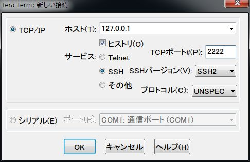
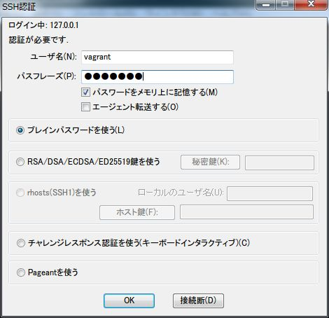
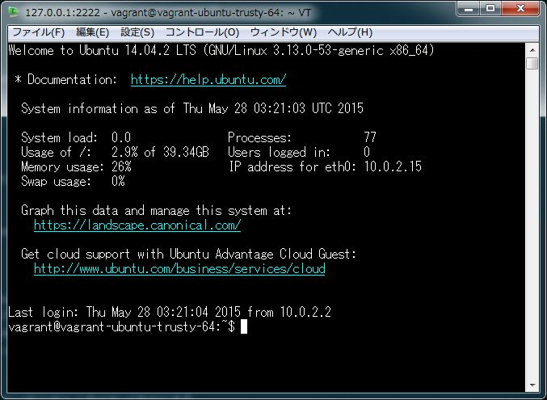

# vagrant-ansible-serverspec

[Ansible](http://www.ansible.com/home)、[Serverspec](http://serverspec.org) を利用できる最低限の環境を、[VirtualBox](https://www.virtualbox.org/) 上に [Vagrant](https://www.vagrantup.com/) を用いて構築する。

プロキシサーバが存在する企業内LANで、ホストOSがWindowsであることを想定している。

## 準備

Gitが入っているのであれば [tenten0213/vagrant-ansible-serverspec](https://github.com/tenten0213/vagrant-ansible-serverspec) をcloneする。

入っていない場合はDownload ZIPからzipファイルを取得し、任意の場所に解凍する。

### VirtualBoxのインストール
* [仮想化ソフトウェア・パッケージ](http://ja.wikipedia.org/wiki/VirtualBox)

VirtualBoxの[ダウンロードページ](https://www.virtualbox.org/wiki/Downloads) から利用環境に合ったインストーラをダウンロードし、インストールする。

### Vagrantのインストール
* [仮想開発環境構築ソフトウェア](http://ja.wikipedia.org/wiki/Vagrant_%28%E3%82%BD%E3%83%95%E3%83%88%E3%82%A6%E3%82%A7%E3%82%A2%29)

Vagrantの[ダウンロードページ](https://www.vagrantup.com/downloads.html) から利用環境に合ったインストーラをダウンロードし、インストールする。

### Vagrantのproxy設定
ゲストOSにProxyの設定をしてくれるVagrantプラグインをインストールする。

```bash
$ vagrant plugin install vagrant-proxyconf
$ vagrant plugin list
vagrant-proxyconf (1.2.0)
```

vagrant-ansible-serverspec/Vagrantfile の以下の箇所を、自身の環境に合ったproxy設定に修正する。

```yaml
config.proxy.http = "http://proxyhost:proxyport/"
config.proxy.https = "http://proxyhost:proxyport/"
```

## 仮想マシンの起動
vagrant-ansible-serverspec配下に移動し、以下のコマンドを実行する。

```bash
$ vagrant up
```

仮想マシンの状態を確認んするには以下のコマンドを実行する。
```bash
$ vagrant status
Current machine states:

default                   running (virtualbox)

The VM is running. To stop this VM, you can run `vagrant halt` to
shut it down forcefully, or you can run `vagrant suspend` to simply
suspend the virtual machine. In either case, to restart it again,
simply run `vagrant up`.
```

仮想マシンをシャットダウンしたい場合は以下のコマンドを実行する。

```bash
$ vagrant halt
```

## 仮想マシンにアクセスし、動作確認する
MacやLinuxがホストの場合は`vagrant ssh`で接続可能だが、Windowsの場合はsshクライアントを利用するのが良い。

以下にTera Termを利用した場合の例を載せる。



ユーザ/パスワードは共に`vagrant`



OKを押すと接続される。



AnsibleとServerspecがインストールされているか確認する。

```bash
$ gem list
gem list

*** LOCAL GEMS ***

diff-lcs (1.2.5)
multi_json (1.11.0)
net-scp (1.2.1)
net-ssh (2.9.2)
rake (10.4.2)
rspec (3.2.0)
rspec-core (3.2.3)
rspec-expectations (3.2.1)
rspec-its (1.2.0)
rspec-mocks (3.2.1)
rspec-support (3.2.2)
serverspec (2.17.0)
specinfra (2.34.4)

$ ansible --version
ansible 1.5.4
```